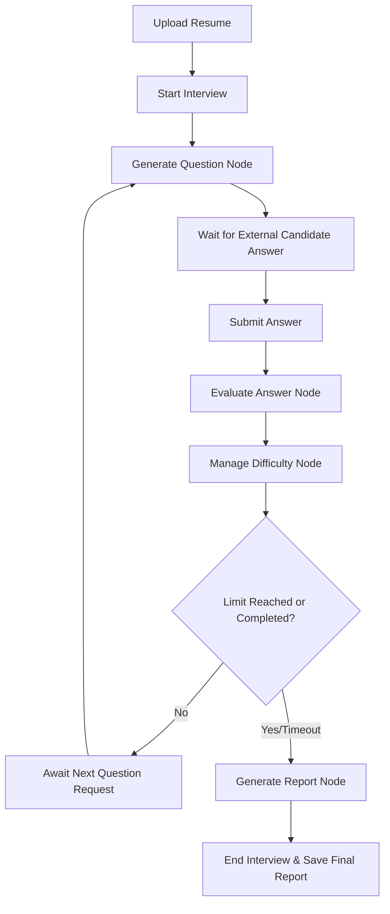

# Technical Analysis & Architectural Report: GenAI Interview Service

This report provides a comprehensive overview of the `genai_service` microservice, explaining its architecture, capabilities, runtime flow, API interface, limitations, and future development opportunities.

---

## 1. Executive Summary
The `genai_service` folder contains a **standalone AI-powered technical interview engine** built as a Python microservice. 
* **Core Stack**: FastAPI (REST API wrapper), LangGraph (state machine and multi-agent orchestration), and Groq SDK (large language model access utilizing `llama-3.3-70b-versatile` by default).
* **Key Purpose**: It automates technical screening of software engineering candidates by reading their resumes, generating tailored technical questions, assessing answers dynamically (using a FAANG-level evaluation rubric), adaptively tailoring the interview difficulty, and compiling a recruiter hiring report.
* **Database Dependency**: **None**. It uses an in-memory KV-store (`MemoryStore`) for temporary metadata and LangGraph's in-memory `MemorySaver` to checkpoint interview states.

---

## 2. Core Capabilities & Architecture

The service coordinates five specialized **AI Agents** within a **LangGraph state machine** to drive the interview process:

```
┌─────────────────────────────────────────────┐
│              FastAPI Server (:8100)          │
│  ┌─────────┐ ┌──────────┐ ┌─────────────┐  │
│  │ Resume  │ │Interview │ │  Dashboard  │  │
│  │ Router  │ │  Router  │ │   Router    │  │
│  └────┬────┘ └────┬─────┘ └──────┬──────┘  │
│       └──────┬─────┴──────────────┘         │
│         InterviewService (in-memory)        │
│       ┌──────┴──────────────────┐           │
│  ┌────┴─────┐          ┌───────┴────────┐  │
│  │MemoryStore│         │ InterviewGraph │  │
│  │  (KV)    │          │  (LangGraph)   │  │
│  └──────────┘          └───────┬────────┘  │
│                    ┌───────────┼──────────┐ │
│               ┌────┴───┐ ┌────┴───┐ ┌────┴┐│
│               │Question│ │Answer  │ │Diff.││
│               │  Gen   │ │Eval    │ │Mgr  ││
│               └────────┘ └────────┘ └─────┘│
│                    ┌───────┴───────┐        │
│               ┌────┴───┐    ┌─────┴──┐     │
│               │Resume  │    │Report  │     │
│               │  Parser  │    │  Gen   │     │
│               └────────┘    └────────┘     │
│                        │                    │
│                   Groq LLM API              │
└─────────────────────────────────────────────┘
```

### The 5 AI Agents
1. **Resume Parser Agent (`ResumeParserAgent`)**: Extracts structured details (name, contact info, skills, projects, employment experience, education, certificates) from resumes. Supports text input, PDFs, and Word (`.docx`) documents.
2. **Question Generator Agent (`QuestionGeneratorAgent`)**: Generates technical questions dynamically grounded in the candidate's extracted resume details, avoiding generic lists.
3. **Answer Evaluator Agent (`AnswerEvaluatorAgent`)**: Evaluates a candidate's answer with detailed constructive critique. Provides numerical scores, list of strengths/weaknesses, expected zero-downtime or advanced considerations, and checks for hallucination.
4. **Difficulty Manager Agent (`DifficultyManagerAgent`)**: Orchestrates the adaptive learning difficulty ladder (Easy ↔ Medium ↔ Hard ↔ Expert). If a candidate answers correctly (score > 85%), it steps up the difficulty. If they struggle (score < 60%), it scales it back. It also selects which skills to probe next based on weaknesses/strengths.
5. **Report Generator Agent (`ReportGeneratorAgent`)**: Generates the final hiring dashboard report when the interview concludes. Highlights skill-by-skill ratings, soft skills (communication, problem-solving, confidence, accuracy), overall hiring recommendation (`strong_hire`, `hire`, `borderline`, `reject`), and customized recruiter summaries.

---

## 3. The Interview Lifecycle (Step-by-Step)

The state-machine workflow follows a modular thread:



1. **Upload Resume**: A client sends a PDF/DOCX or text block. The service returns a `candidate_id` and parsed skills.
2. **Start Interview**: Triggered using the `candidate_id`. LangGraph initializes a thread, saves candidate metadata, generates **Question 1**, and changes the status to `awaiting_answer`.
3. **Submit Answer**: The user inputs their textual response. The graph transitions to `evaluate_answer` where the LLM evaluates the answer, then transitions to `manage_difficulty` to assess performance and adjust difficulty levels.
4. **Get Next Question**: Generates the next question using the updated difficulty tier and focus skills.
5. **Complete/End Interview**: Once the question limit (default: 15) or time limit (default: 30 minutes) is hit, or the candidate quits, the engine builds the final report with recommendations.

---

## 4. API Endpoint Index

The FastAPI server listens on port `8100` and serves the following endpoints (all wrapped in standard JSON response wrappers):

| HTTP Method | Route | Description |
|---|---|---|
| `GET` | `/health` | Server health and model configurations status |
| `POST` | `/api/v1/upload_resume` | Accepts file upload or raw text; returns candidate profile and ID |
| `POST` | `/api/v1/start_interview` | Initiates the session; generates the initial question |
| `POST` | `/api/v1/submit_answer` | Submits candidate answer; evaluates and adjusts difficulty |
| `POST` | `/api/v1/next_question` | Retrieves next dynamically generated question |
| `POST` | `/api/v1/end_interview` | Finalizes interview early and returns full hiring report |
| `GET` | `/api/v1/interview/{id}` | Fetches detailed session state, histories, and grades |
| `GET` | `/api/v1/dashboard/candidates` | Lists all candidates with active or completed interviews |
| `GET` | `/api/v1/dashboard/chat-history/{id}` | Returns question/answer exchange history with feedback |
| `GET` | `/api/v1/dashboard/{candidate_id}` | Compiles analytics dashboard metrics (skill matrices, trajectory charts) |

---

## 5. What We Can Do With This Folder (Possibilities & Roadmap)

This folder is a fully functioning **interview engine microservice** that can be utilized, enhanced, and integrated in several ways:

### A. Run it Locally or on Docker
You can spin up this engine immediately for development or testing:
1. Create a `.env` file from `.env.example` and set your `GROQ_API_KEY`.
2. Install dependencies: `pip install -r requirements.txt`.
3. Run the server: `uvicorn genai_service.main:app --port 8100 --reload` (or run it via the Docker commands in `README.md`).
4. Access the interactive Swagger API documentation at `http://localhost:8100/docs`.

### B. Integrate it with an ATS Backend (e.g. Spring Boot / Node.js)
If you are developing a recruitment platform (like **FutureHire**), you can hook your primary backend up to this microservice:
* Your backend handles persistent database tables (e.g., candidate profiles, job postings, recruiter notes).
* When a candidate clicks "Start Interview," your backend sends a request to `genai_service:8100/api/v1/upload_resume` followed by `/start_interview`.
* Your frontend interacts with the candidate via websockets or standard REST endpoints, relaying answers back to `/submit_answer` and grabbing the next question from `/next_question`.
* Once finished, your backend fetches the report from `/end_interview` and persists it permanently in your own database (PostgreSQL/MySQL).

### C. Major Upgrades & Enhancements You Can Implement

1. **Add Database Persistence (High Priority)**
   * *Problem*: All data is stored in-memory. If the FastAPI process restarts, all candidates, sessions, and histories are deleted.
   * *Solution*: Modify `memory/store.py` to connect to a Redis or MongoDB database. Swap LangGraph's `MemorySaver` checkpointer for `SqliteSaver` or `PostgresSaver` in `graph/interview_graph.py` to persist graph histories.
   
2. **Support Audio/Voice Interviews (Speech-to-Text & TTS)**
   * *Solution*: 
     * Implement an endpoint (or integrate directly in your frontend) that captures candidate audio answers, parses them using a Speech-to-Text model (like OpenAI Whisper or Deepgram), and forwards the transcript to `/submit_answer`.
     * Add Text-to-Speech (TTS) (using ElevenLabs or Amazon Polly) to read out the generated questions, mimicking a real voice-call experience.

3. **Integrate an Interactive Code Sandbox**
   * *Problem*: The service asks technical questions, but cannot execute and verify code correctness.
   * *Solution*: Connect the evaluation pipeline to a secure code execution sandbox (e.g., Py调, Docker sandbox, or Judge0 API) so candidates can write code and have it compiled and run against unit tests, with output scores piped back into the Answer Evaluator.

4. **Add Multi-LLM Provider Support**
   * *Solution*: Currently, the service is tied to Groq. Modify `services/llm_service.py` to support other models (OpenAI GPT-4o, Anthropic Claude 3.5 Sonnet, Gemini 1.5 Pro) using `langchain-openai` or generic LiteLLM packages to allow cost/latency toggles.

5. **Build a Recruiter Analytics Dashboard UI**
   * *Solution*: Create a beautiful admin interface (using React, Tailwind CSS, and Chart.js/Recharts) that fetches data from `/api/v1/dashboard/{candidate_id}` to draw:
     * A radar chart for skill scores (e.g., Python: 85%, React: 40%).
     * A line chart showing the candidate's difficulty level over time (the difficulty trajectory).
     * Interactive chat bubble playback of the interview questions and candidate answers.

---

## 6. Project Structure Overview

Here is a summary of the folders in this directory:

* `agents/`: Contains the cognitive logic for each persona (evaluator, generator, parser, difficulty manager, report generator).
* `graph/`: Contains the LangGraph configuration (`interview_graph.py`) defining the nodes, transitions, and conditionals.
* `memory/`: Contains `store.py` containing the in-memory candidate and interview state indexes.
* `prompts/`: Contains the engineering templates for system and user prompts used to instruct the LLM.
* `routers/`: Contains FastAPI routes split by feature (resumes, interviews, dashboard).
* `schemas/`: Houses Pydantic models mapping the request payloads, response bodies, and JSON schemas.
* `state/`: Holds `interview_state.py` outlining the schema of the LangGraph shared state.
* `utils/`: Includes auxiliary code for logging, error types, formatting, and helper methods.
